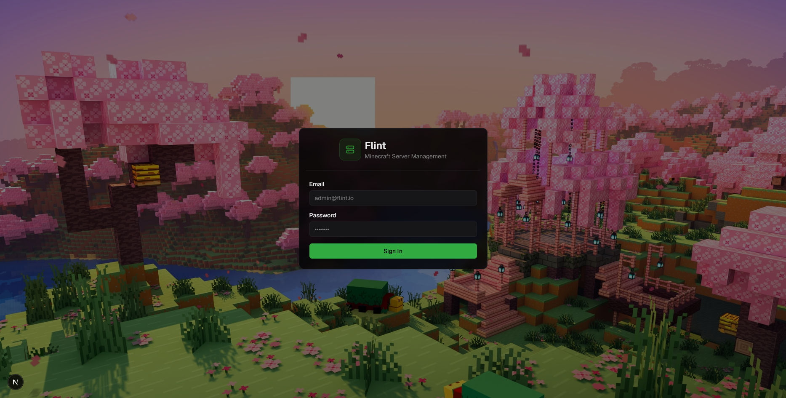
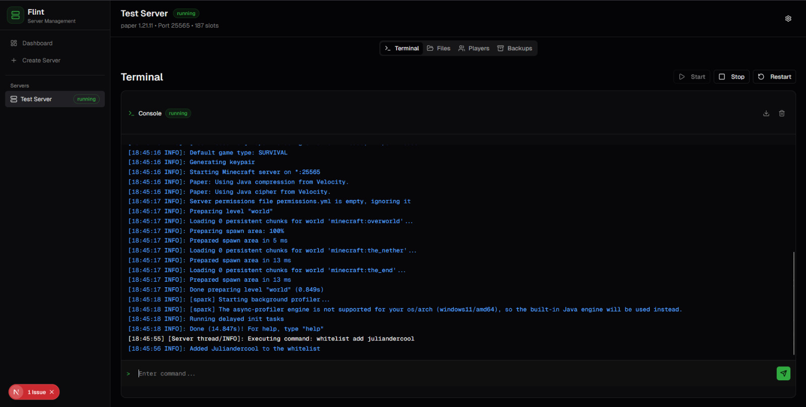
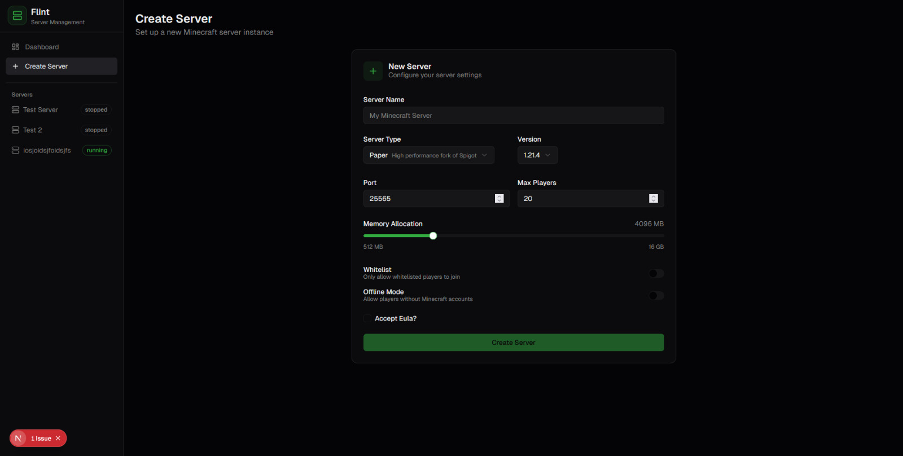
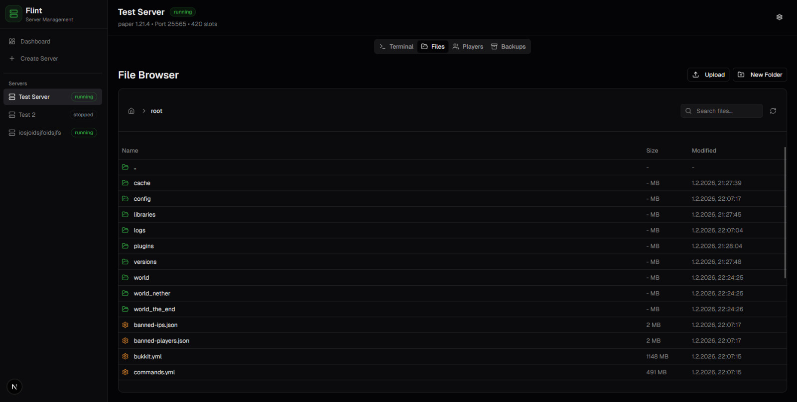

# Flint

Flint is a self-hosted Minecraft server management tool designed to make running and organizing your servers easier.

> ⚠️ **Early Development**: Flint is in its very early stages. Expect breaking changes and limited functionality.

### Features (Planned):

- Easy configuration management
- Lightweight & self-hosted
- Backup system

### Installation

Currently, Flint is under active development. Instructions will be provided once the first stable version is ready.

### Contributing

Contributions are welcome! Feel free to open issues or submit pull requests.